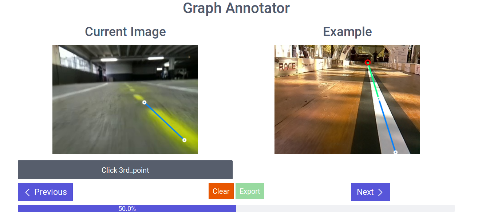

Graph Annotator with Flask and Javascript
==================

It is an annotation web app built on that project : [https://github.com/kyamagu/js-graph-annotator](https://github.com/kyamagu/js-graph-annotator)

[Online demo of the original project](http://kyamagu.github.io/js-graph-annotator/).



### Dependencies
- Flask
- numpy
- gunicorn for multiprocess server

### Instructions
1. Put your images (.jpg) in a folder in the directory `static/img/`

2. Edit the config line 14-15 of `app.py` to match your dataset:
```python
DATASET_NAME = "tanker"
DATASET_FOLDER = "static/img/tanker/"
```

### Launch the server

```
python app.py
```

or
```
./start.sh
```
